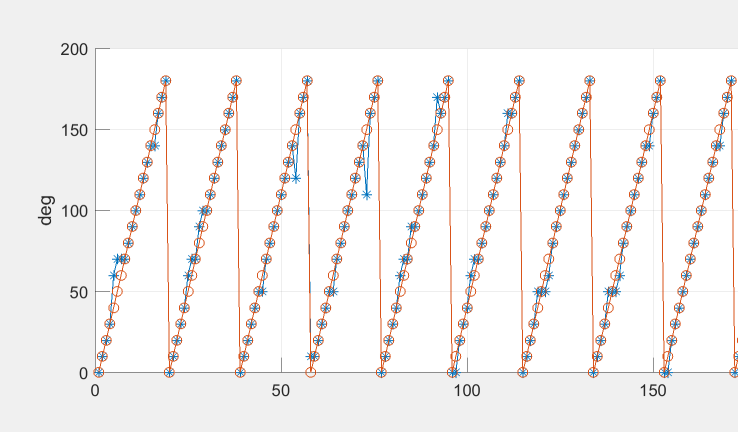
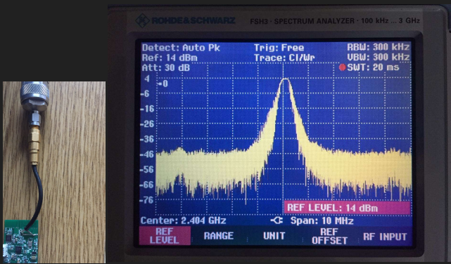
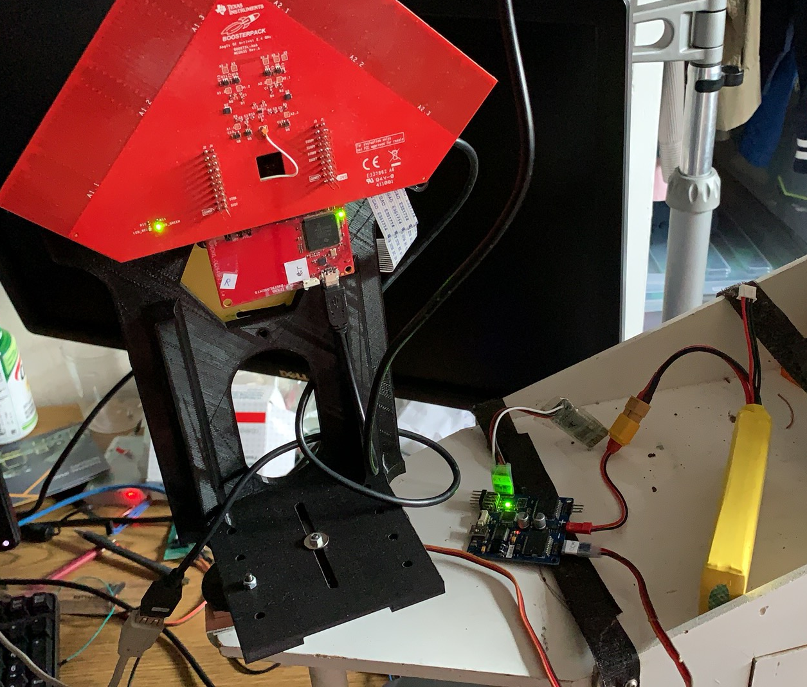

# 2.4GHz passive phased-array radar angle of arrival estimate
his is a project uses one TI CC2640 chip for CW tone transmission, another CC2640 makes TDMA reception among multiple antenna elements. The phase estimate is then converted to angle of arrival estimate through machine learning algorithm. Here are some live signal testing results.

To tune the system performance, several categories of antennas, whip, ceramic, PCB antenna, are tested. 

Below is the test automation device to find corner cases systematically. The operation of the testing plan and commanding of the actuator are implemented in python code here, the C program for data collection is also launched by the python scheduler.

